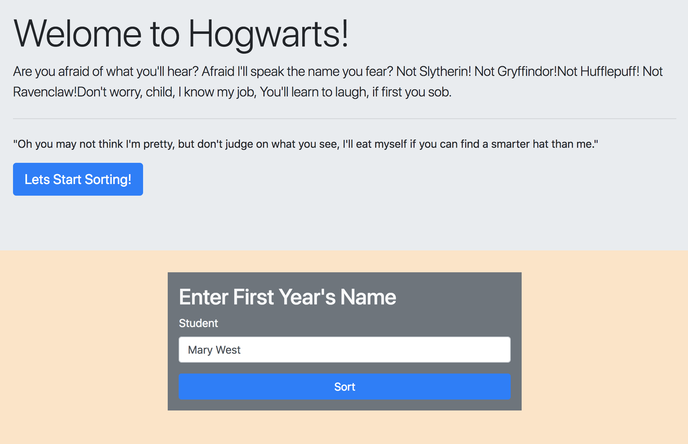

# Sorting-Hat

## Description
We made a Harry Potter sorting hat that randonly spits out what house you will be in. 

## Screenshots

## How to run this project
* Use npm to intall http-server in your terminal:
```sh
npm install -g http-server
```
* Run the server
```sh
hs -p 9999
```
* Open chrome and navigate to:
```
localhost:9999
```